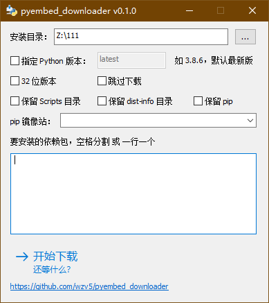
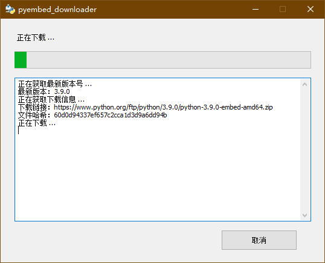

# Python Embedded Downloader

写着玩，用 rust 写了个 python 嵌入式环境下载器。

执行的工作很简单（批处理也能搞定）：

1. 下载嵌入式的压缩包和 get-pip.py
2. 使用嵌入式 python 运行 get-pip.py 来安装 pip
3. 通过 pip 安装指定的依赖包
4. 把所有 .py 编译成 .pyc
5. 清理，删除 pip 等不需要的包，删除一些不需要的目录

相比 pyinstaller，用这种方式打包的 python 环境，运行更加高效，因为不必每次都把文件解压到临时目录再运行。

至于为什么用 rust 写，因为我闲。。

## 下载

仅限 Windows 系统。

<https://github.com/wzv5/pyembed_downloader/releases/latest>

分为 CLI 和 GUI 版本，功能相同，随意选择使用。

## 截图





## CLI 用法

``` text
USAGE:
    pyembed_downloader_cli [FLAGS] [OPTIONS] [PACKAGES]...

FLAGS:
        --32                下载 32 位版本，默认下载 64 位版本
    -h, --help              Prints help information
        --keep-dist-info    保留 dist-info 目录，删除此目录后将无法再通过 pip 管理依赖
        --keep-pip          保留 pip、setuptools、wheel 依赖包
        --keep-scripts      保留 Scripts 目录
        --skip-download     跳过下载，直接使用已有的文件
    -V, --version           Prints version information

OPTIONS:
        --dir <dir>           工作目录，默认为当前目录
        --pip-mirror <url>    通过指定 pip 镜像站下载依赖包
        --py-ver <ver>        下载指定版本的 Python，如 3.8.6 [default: latest]

ARGS:
    <PACKAGES>...    要安装的 pip 依赖包
```

## 代码说明

用 rust 写纯属没事找事，好孩子不要学。尤其是用 rust 写 GUI，简直了，比 C++ 写要麻烦太多。

这也是我第一次用 rust 写 GUI 程序，写写改改，快改疯了，好在最后还是给搞了出来。

如果你也想用内嵌 Dialog 资源的形式创建窗口，`gui/src/dialog.rs` 可以用来参考，该类简单了封装了对话框函数和消息处理。

`gui/res/app.rc` 文件是用资源编辑器拖控件拖出来的，这样的工具有好多，比如 ResEd（masm 汇编用的，也是易语言黑月资源编辑器）。
